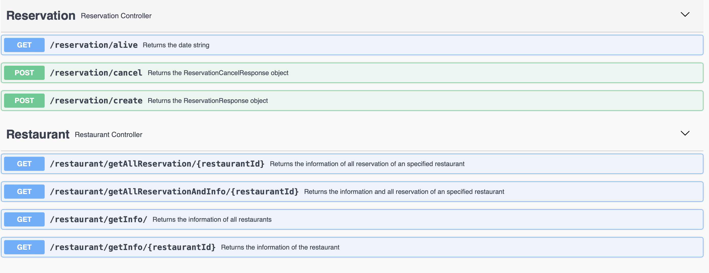

# spring-boot-restaurant-reservation
## Summary
A backend REST API applicaiton for restaurant reservation platform developed using Spring Boot. The system consists of 2 major API for 2 resources:
1. Restaurant
   - List restaurant information
   - List all reservations of a specific restaurant
2. Reservation
   - Create a reservation
   - Cancel a reservation

The persistance layer used Postgres as database. The libraries used in this project includes:
- Spring Boot
- JPA
- Swagger
- Lombok
- Junit

The application is built and installed using Maven and Docker. Build the project by 
```
git clone https://github.com/kitshinghk-crypto/spring-boot-restaurant-reservation.git
docker-compose up
```

## Screenshot
 
